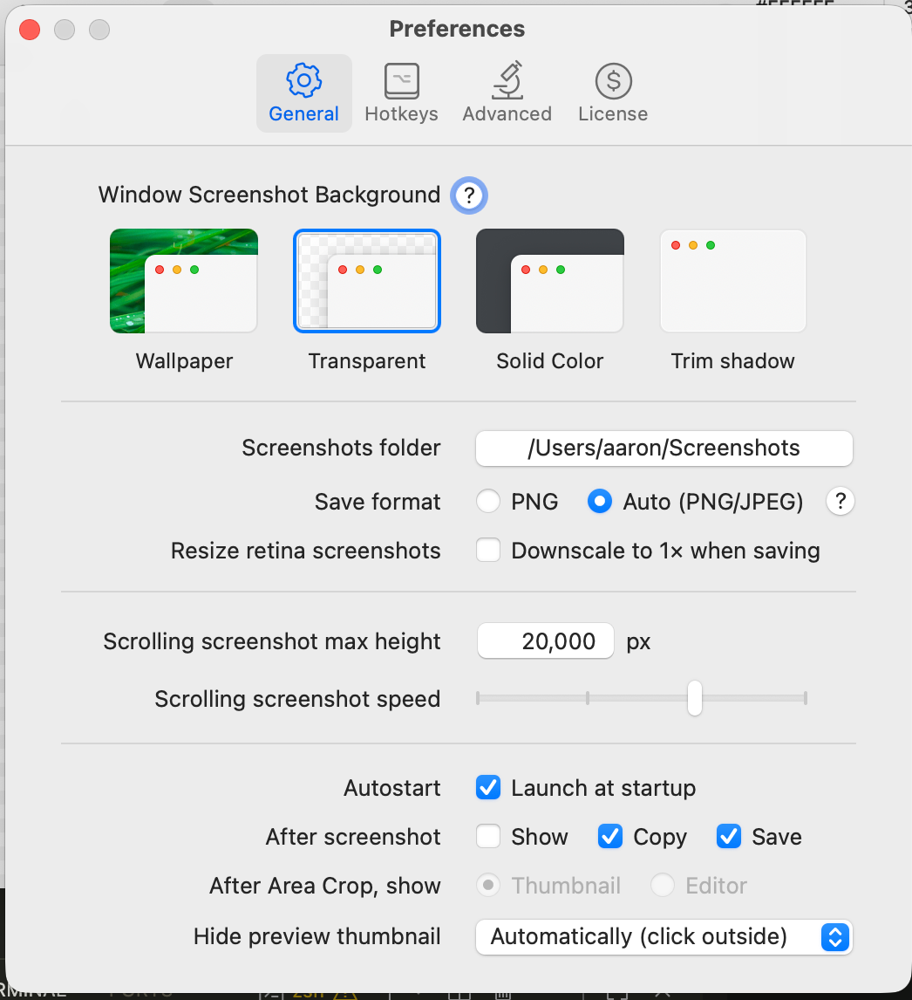

# Shottr Setup

> ⚠️ Installed via Homebrew

1. Make sure all of the default keyboard shortcuts are set up/turned off in macOS.

System Preferences > Keyboard > Shortcuts

1. Pull the license from 1Password and set it in Shottr.

2. Update Shottr settings:

## Notes

This is a test edit to check the markdownlinting hook.
